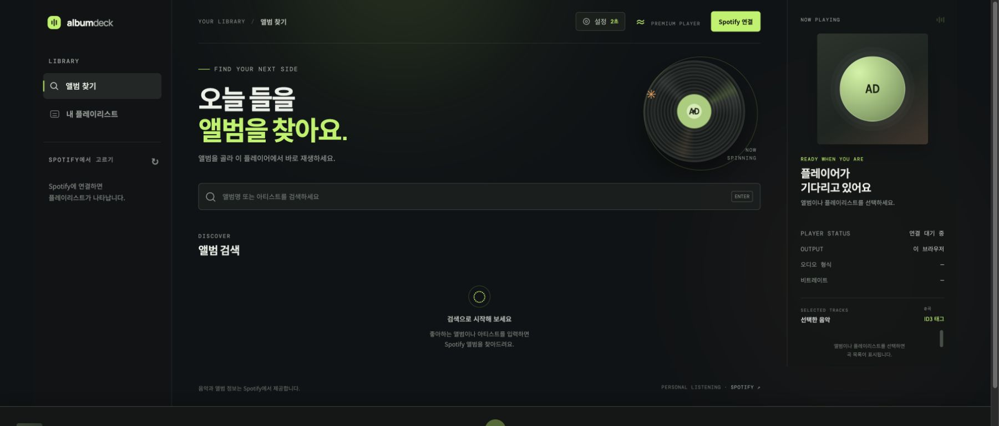
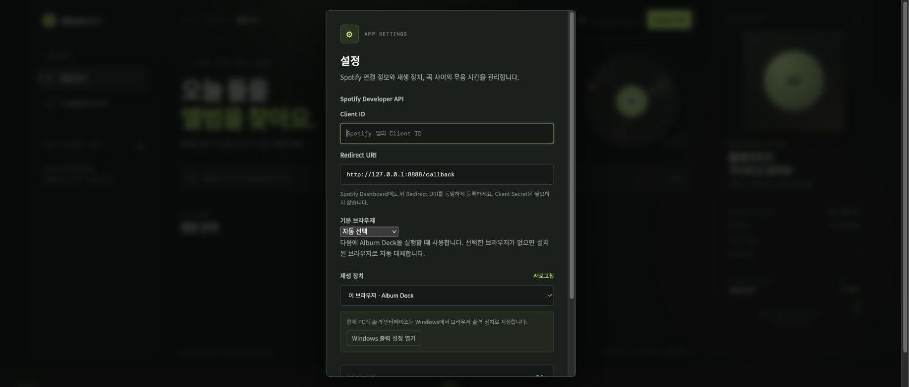

# Album Deck

[한국어](README.md) | [English](README.en.md)

Album Deck is a personal Spotify web player designed for MiniDisc recording. It plays albums and playlists one track at a time and inserts a configurable silent gap between tracks. It does not download or save Spotify audio; Spotify Web Playback SDK and Web API calls run directly in the browser.



## Features

- Search by album or artist and play a complete album in order
- Browse and play your Spotify playlists
- Insert 0–30 seconds of silence between tracks in 0.5-second steps
- Play through the Album Deck browser player or another Spotify Connect device
- Show platform-specific guidance for Windows per-app output and macOS system output
- Open the complete Korean or English guide from the in-app **Help** button
- Write Spotify metadata to ID3 tags in existing MP3 files
- Run through the Windows installer, npm, Vercel, or a general Node.js host

## Requirements

- Windows 10/11, macOS, or another environment that can run Node.js
- Node.js 20 or newer (the Windows release installer can install it automatically)
- A Spotify Premium account
- A Client ID from your own Spotify Developer app
- An audio cable between the PC and MiniDisc recorder when recording through an optical or analog output

If the Spotify app is in development mode, add every Spotify account that will use Album Deck to the app's user list in the Developer Dashboard. Album Deck never asks for or distributes a Client Secret.

## Quick start with the Windows release ZIP

1. Download the [latest Windows release ZIP](https://github.com/YoungkyunKong/spotify-md-rec/releases/latest/download/album-deck-windows-v1.1.0.zip).
2. Extract the entire ZIP into a new folder. Do not run the installer from inside the ZIP preview.
3. Double-click `install-windows.cmd` in the extracted folder.
4. If Node.js 20 or newer is missing, the installer uses Windows `winget` to install Node.js LTS. Allow the Windows permission prompt if one appears.
5. Start **Album Deck** from the desktop shortcut.
6. Complete **Create a Spotify Developer app** and **First-time Album Deck setup** below once.

The app is installed in `%LOCALAPPDATA%\Programs\AlbumDeck`. The installer creates **Album Deck** shortcuts on the desktop and Start menu, plus **Album Deck Stop** in the Start menu for stopping the background server. The app window prefers Edge, then Chrome, and finally the system default browser.

If the installer reports that `winget` is unavailable, install **App Installer** from Microsoft Store or install Node.js 20 or newer manually, then run `install-windows.cmd` again.

### Updating an existing installation

Extract the new release ZIP into a separate folder and run `install-windows.cmd` again. The installer stops the existing Album Deck server and updates the application files and shortcuts. Your Client ID, login session, output device, and silent-gap setting remain available when you use the same Windows user and browser profile.

## Run on macOS

When you run the `album-deck` command on macOS, Album Deck opens Safari by default. You can choose an installed Chrome or Edge under **Settings → Default browser**. If the selected browser is unavailable, Album Deck falls back to Safari. Spotify Web Playback SDK supports desktop Safari.

Choose the device connected to the MD recorder under **System Settings → Sound → Output**. macOS applies this choice to the entire Mac rather than Safari alone. To route Safari to one device while other apps continue through the built-in speakers, use a per-application audio router such as [SoundSource](https://rogueamoeba.com/soundsource/).

## Create a Spotify Developer app

Album Deck needs your own Spotify Developer app for login and playback.

1. Sign in to the [Spotify Developer Dashboard](https://developer.spotify.com/dashboard).
2. Select **Create app** and enter a name and description. For example, use `Album Deck` and `Personal MiniDisc recording player`.
3. Enter the following Redirect URI exactly:

   ```text
   http://127.0.0.1:8888/callback
   ```

4. Save the app with Web API and Web Playback SDK enabled.
5. Copy the new app's **Client ID**. You do not need its Client Secret.
6. If the app is in development mode and another Spotify account will sign in, add that account in the app's user-management settings.

Use `127.0.0.1`, not `localhost`. The protocol, host, port, path, capitalization, and trailing slash must match the registered Redirect URI exactly. For a public deployment, register that HTTPS deployment URL followed by `/callback` as an additional Redirect URI.

## First-time Album Deck setup

Start **Album Deck** from the desktop, or run `npm start` and open [http://127.0.0.1:8888](http://127.0.0.1:8888).

1. Select **설정** (Settings) at the top of the app.
2. Paste the Client ID copied from Spotify Dashboard into **Client ID**.
3. Confirm that **Redirect URI** is `http://127.0.0.1:8888/callback`.
4. Choose the browser Album Deck should use the next time it starts. Windows uses Edge or Chrome, while macOS uses Safari by default.
5. Choose a playback device:
   - **이 브라우저 · Album Deck** (This browser · Album Deck) sends audio through the current PC. This is normally the correct choice for MD recording.
   - Select another listed Spotify Connect device to play through that device.
6. Set the silent gap. Track detection varies by recorder and connection, so begin with a 2–3 second test.
7. Select **저장** (Save).



Album Deck stores these settings and the Spotify login token in the current browser's local storage. On a shared PC, use **Spotify 연결됨 → 연결 해제** (Spotify connected → Disconnect) when you finish.

## Connect Spotify

1. Select **Spotify 연결** (Connect Spotify) in the upper-right corner.
2. Choose the Premium account on Spotify's login and authorization page.
3. After authorization, Spotify returns you to Album Deck automatically.
4. Confirm that the button changes to **Spotify 연결됨** and your playlists appear.

To use another account, select **Spotify 연결됨 → 다른 계정으로 연결**. If Spotify automatically selects the current account, use **Not you?** on the Spotify page.

The first login requests these scopes: `streaming`, `user-read-private`, `user-read-email`, `user-read-playback-state`, `user-modify-playback-state`, `playlist-read-private`, and `playlist-read-collaborative`.

## Play an album or playlist

Select **도움말** (Help) at the top of the app to open this guide inside Album Deck. Use **English** at the top of the guide to switch languages, or select **새 창에서 열기** (Open in new window) for a larger browser view.

### Play an album

1. Select **앨범 찾기** (Find albums) in the left sidebar.
2. Enter an album or artist name and press Enter.
3. Select an album card in the results.
4. Check the tracks and order under **선택한 음악** (Selected tracks) on the right.
5. Playback starts from the first track. When a track finishes, Album Deck waits for the configured silent gap before starting the next track.

### Play a playlist

1. Select **내 플레이리스트** (My playlists) in the left sidebar.
2. Select the desired playlist.
3. Check the tracks and their order before recording.

Album Deck does not modify the original Spotify album or playlist. Unavailable tracks may be removed from the playback queue, so verify the actual track count displayed in Album Deck before recording.

The bottom player controls playback, previous and next track, seek position, and volume. `AAC · 256 kbps` describes Spotify's published web-player format; Album Deck does not measure the current stream. The app cannot inspect the actual format or bitrate on another Spotify Connect device and displays it as unavailable.

## Record to MiniDisc

### 1. Check the connection and audio output

1. Connect the PC's optical output or audio-interface output to the MiniDisc recorder input.
2. In Album Deck, choose **이 브라우저 · Album Deck** under **Settings → Playback device**.
3. On Windows, select **Windows 출력 설정 열기** (Open Windows output settings) and route Edge or Chrome to the audio device connected to the recorder.
4. On macOS, choose the MD-connected device under **System Settings → Sound → Output**. This changes system-wide output; use a per-application audio router if Safari alone must use the device.
5. Close other audio sources, or route notifications and other system audio to another output.
6. Play a short test track and check the recorder's input level and left/right channels.

### 2. Test the silent gap

1. Enable automatic track marking on the MD recorder.
2. Start with a 2–3 second silent gap in Album Deck.
3. Record two or three test tracks.
4. Check that the recorder created one MD track for each song.
5. Increase the gap if tracks are joined. If tracks split unexpectedly, check the recorder's track-mark setting and input level.

### 3. Make the recording

1. Select an album or playlist in Album Deck and verify the track order on the right.
2. Put the MD recorder into record-pause or recording-ready mode.
3. Start recording on the MD recorder, then start the first track in Album Deck.
4. Keep the Album Deck window open and prevent the PC from sleeping. The page detects track endings and starts each next track.
5. After the final track finishes and Album Deck stops, stop the MD recorder.
6. Check the MD track count, order, beginnings, and endings.

Spotify or network response time can add a little extra delay after the configured silent gap. Make a test recording with the same recorder and connection before an important recording session.

## Write ID3 tags to MP3 files

This feature writes metadata from the selected Spotify album or playlist to MP3 files you already own. It does not save Spotify audio as MP3 files.

1. Select an album or playlist first.
2. Select **ID3 태그** above the track list on the right.
3. Select **MP3 폴더 선택** (Choose MP3 folder) and choose the folder containing the files.
4. Check the displayed MP3 file count and Spotify track count.
5. Arrange filenames in natural numeric order (`01`, `02`, `03`, and so on). Album Deck matches this order to the Spotify track order.
6. Select **태그 기록** (Write tags).

Album Deck writes the title, artist, album, original album track number, disc number, and release year when available. When tagging a playlist, it uses each song's position on its source album instead of its playlist position. A file is skipped when its duration differs from the Spotify track by more than 10 seconds. If the browser cannot write to the selected folder, it downloads a tagged copy instead of replacing the original. Test with copies of important files first.

## Troubleshooting

### Spotify connects but playback does not start

- Confirm that the account has Spotify Premium.
- Confirm that the login account is in the Developer app's user list.
- Check the Client ID and Redirect URI again.
- In a current Safari, Edge, or Chrome release, allow protected-content playback (EME).
- Start playback briefly in the Spotify app, then refresh the device list in Album Deck settings.

### `INVALID_CLIENT` or Redirect URI error

- Make sure the Dashboard and Album Deck values match exactly.
- Use `http://127.0.0.1:8888/callback` for local operation.
- `localhost`, a different port, different capitalization, or an extra trailing slash is treated as a different address.

### Playlists do not appear

- Select the refresh button beside the playlist heading in the left sidebar.
- Confirm that private and collaborative playlist permissions were approved.
- Disconnect Spotify in Album Deck and connect again.

### The MD recorder does not split tracks

- Increase the silent gap.
- Check automatic track marking or digital sync recording on the recorder.
- Make sure browser notifications or other system sounds do not enter the silent gap.

### The server remains after the Album Deck window closes

Closing the Windows app window may leave the local server running for the next launch. Run **Album Deck Stop** from the Start menu to stop it.

## Other ways to run Album Deck

### Run from the repository

```powershell
git clone https://github.com/YoungkyunKong/spotify-md-rec.git
cd spotify-md-rec
npm start
```

Open [http://127.0.0.1:8888](http://127.0.0.1:8888). Press `Ctrl+C` in the terminal to stop the server.

### Install from npm

```powershell
npm install --global album-deck
album-deck
```

To run it once without installing globally:

```powershell
npx album-deck
```

## Deployment

### Build the Windows release ZIP

```powershell
npm run build:windows-zip
```

The command creates `dist/album-deck-windows-v<version>.zip`. The archive includes the app, installer scripts, Korean and English README files, and the screenshots under `docs/images`. It also generates `사용설명서.html` and `User-Guide.html` from the corresponding README files, so release users receive the same instructions shown on GitHub. The archive excludes `node_modules`, `.git`, and development build caches.

### Deploy to Vercel

1. Import this GitHub repository as a new Vercel project.
2. Keep the repository root as the Root Directory. `vercel.json` configures Framework Preset `Other`, build command `npm run build:vercel`, and output directory `public`.
3. Note the stable production URL, such as `https://album-deck.vercel.app`.
4. Add `https://your-production-domain/callback` to the Spotify app's Redirect URIs.
5. In the deployed Album Deck settings, save the same Redirect URI and your Client ID, then connect Spotify.

Set `SPOTIFY_CLIENT_ID` in Vercel to provide a default Client ID to new browsers. With a custom domain, set `PUBLIC_URL=https://your-production-domain` to provide a fixed Redirect URI default. Because Preview URLs can change on each deployment, test Spotify login on the registered stable production URL.

### Deploy to Node.js or Render

Use Node.js 20 or newer, start command `npm start`, and health-check path `/healthz`. On Render, use the included `render.yaml` Blueprint or configure the service manually:

```text
Runtime: Node
Build Command: npm install --omit=dev
Start Command: npm start
Health Check Path: /healthz
```

Optional environment variables:

```text
SPOTIFY_CLIENT_ID=your_spotify_client_id
PUBLIC_URL=https://your-production-domain
```

A public deployment must use HTTPS. Register its exact `/callback` URL in Spotify Dashboard. Playback monitoring and silent-gap transitions run in the user's browser tab, so closing the tab also stops automatic track transitions.

## Development and validation

```powershell
npm run check
npm start
```

The Node.js server only provides static files from `web/` and public runtime configuration. The browser sends login, search, and playback requests directly to Spotify. Album Deck does not use a Client Secret.

Spotify supplies all music, artwork, and metadata. Album Deck only performs account authorization and browser playback; it does not download or save Spotify audio. See the [Spotify Web Playback SDK](https://developer.spotify.com/documentation/web-playback-sdk), [Spotify Redirect URI guide](https://developer.spotify.com/documentation/web-api/concepts/redirect_uri), and [Spotify User Guidelines](https://www.spotify.com/us/legal/user-guidelines/).
